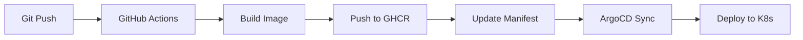

# 🎸 GuitarTortona Infrastructure

Infrastructure-as-Code per GuitarTortona su MicroK8s con GitOps (ArgoCD).

## 📋 Panoramica

Questa infrastruttura fornisce:

- **MicroK8s** cluster Kubernetes single-node
- **DNS locale** con wildcard `*.guitar.lab` (dnsmasq)
- **Certificati SSL** self-signed per development (cert-manager)
- **Secrets management** con HashiCorp Vault + External Secrets Operator
- **Database** MariaDB con backup automatici
- **CI/CD** con GitHub Actions Runner
- **GitOps** con ArgoCD per deploy automatici

## 🏗️ Architettura
```
┌─────────────────────────────────────────────────────────┐
│  MacBook (Host)                                         │
│  └─ Browser → https://app.guitar.lab                   │
│      ↓                                                   │
│  └─ /etc/hosts → 192.168.64.9 (VM IP)                  │
└─────────────────────────────────────────────────────────┘
                        ↓
┌─────────────────────────────────────────────────────────┐
│  Ubuntu VM (192.168.64.9)                               │
│  ├─ dnsmasq → *.guitar.lab → 192.168.64.100            │
│  └─ MicroK8s Cluster                                    │
│      ├─ MetalLB → 192.168.64.100-110                   │
│      ├─ Ingress NGINX → LoadBalancer IP: .100          │
│      ├─ Cert-Manager → Wildcard SSL                    │
│      ├─ Vault → Secrets storage                        │
│      ├─ External Secrets Operator → K8s secrets sync   │
│      ├─ MariaDB → Staging + Production DBs             │
│      ├─ GitHub Runner → CI/CD automation               │
│      └─ ArgoCD → GitOps deployment                     │
└─────────────────────────────────────────────────────────┘
                        ↓
┌─────────────────────────────────────────────────────────┐
│  GitHub                                                 │
│  ├─ guitartortona-infrastructure (questo repo)         │
│  └─ guitartortona-api-deploy                           │
│      ├─ main branch → production namespace             │
│      └─ staging branch → staging namespace             │
└─────────────────────────────────────────────────────────┘
```

## 🚀 Quick Start

### Prerequisiti

- Ubuntu 24.04 LTS VM (minimo 4 CPU, 8GB RAM)
- IP statico: `192.168.64.9`
- Accesso sudo
- GitHub Personal Access Token (scope: `repo`, `workflow`, `admin:org`)

### Setup Completo (30-40 minuti)
```bash
# 1. Clona repository
git clone https://github.com/mmzitarosa/guitartortona-infrastructure.git
cd guitartortona-infrastructure

# 2. Esegui setup automatico
./scripts/full-setup.sh

# 3. Configura DNS sul tuo Mac
echo "192.168.64.9 guitar.lab" | sudo tee -a /etc/hosts
echo "192.168.64.9 app.guitar.lab" | sudo tee -a /etc/hosts
echo "192.168.64.9 staging.guitar.lab" | sudo tee -a /etc/hosts

# 4. Importa CA nel browser
# Apri: /tmp/guitar-ca/guitar-ca.crt
# Chrome: Impostazioni → Privacy e sicurezza → Gestisci certificati → Autorità → Importa

# 5. Verifica
kubectl get pods -A
curl -k https://app.guitar.lab  # Dovrebbe dare 404 (OK, Ingress funziona)
```

## 📖 Documentazione Completa

Segui questi documenti in ordine per setup manuale dettagliato:

1. [Initial Setup](docs/01-initial-setup.md) - VM + MicroK8s + addons
2. [DNS Configuration](docs/02-dns-configuration.md) - Wildcard DNS con dnsmasq
3. [Certificates](docs/03-certificates.md) - CA generation + cert-manager
4. [Vault Setup](docs/04-vault-setup.md) - Secrets storage initialization
5. [External Secrets](docs/05-external-secrets.md) - ESO + ClusterSecretStore
6. [MariaDB](docs/06-mariadb.md) - Database deployment
7. [GitHub Runner](docs/07-github-runner.md) - CI/CD runner
8. [ArgoCD](docs/08-argocd.md) - GitOps deployment

## 🔐 Secrets Management

Le credenziali sono memorizzate in:
- **Vault** (runtime): secrets cifrati accessibili dai pod
- **`~/guitar-credentials.env`** (host): backup locale password (NON committare)

### Secrets Gestiti
```
secret/guitartortona/
├── mariadb/root_password
├── staging/mariadb/{username,password,database}
├── production/mariadb/{username,password,database}
└── github/{username,token}
```

## 🎯 Namespace Organization
```
default              → Production apps (ArgoCD-managed)
staging              → Staging apps (ArgoCD-managed)
databases            → MariaDB StatefulSet
vault                → HashiCorp Vault
external-secrets     → External Secrets Operator
cert-manager         → Certificate management
ingress              → NGINX Ingress Controller
actions-runner-system → GitHub Actions Runner
argocd               → ArgoCD GitOps
```

## 🌐 DNS Resolution Flow
```
Browser (https://app.guitar.lab)
    ↓
Mac /etc/hosts (192.168.64.9)
    ↓
VM dnsmasq (*.guitar.lab → 192.168.64.100)
    ↓
MetalLB LoadBalancer IP (192.168.64.100)
    ↓
NGINX Ingress Controller
    ↓
Kubernetes Service → Pod
```

## 🔧 Comandi Utili
```bash
# Verifica cluster
kubectl get nodes
kubectl get pods -A

# Vault
kubectl exec -it vault-0 -n vault -- vault status
source ~/guitar-credentials.env
kubectl exec -it vault-0 -n vault -- sh -c "
  export VAULT_TOKEN=$VAULT_ROOT_TOKEN
  vault kv get secret/guitartortona/mariadb
"

# MariaDB
kubectl exec -it mariadb-0 -n databases -- mariadb -u root -p

# ArgoCD
kubectl get applications -n argocd
kubectl -n argocd get secret argocd-initial-admin-secret \
  -o jsonpath="{.data.password}" | base64 -d

# DNS test
dig app.guitar.lab @127.0.0.1
nslookup staging.guitar.lab 127.0.0.1

# Certificati
kubectl get certificate -A
kubectl describe certificate guitar-wildcard-cert
```

## 🔄 Deployment Workflow


### Repositories

- **Infra**: `guitartortona-infrastructure` (questo repo)
- **App**: `guitartortona-api-deploy`
    - `main` branch → `default` namespace (production)
    - `staging` branch → `staging` namespace

## 🛠️ Troubleshooting

### DNS non funziona
```bash
# Verifica dnsmasq
sudo systemctl status dnsmasq
sudo netstat -tulpn | grep :53
dig test.guitar.lab @127.0.0.1

# Restart se necessario
sudo systemctl restart dnsmasq
```

### Vault sealed
```bash
source ~/guitar-credentials.env
kubectl exec -it vault-0 -n vault -- vault operator unseal $VAULT_UNSEAL_KEY
```

### ExternalSecret non sincronizza
```bash
kubectl describe externalsecret <name> -n <namespace>
kubectl logs -n external-secrets deployment/external-secrets
```

### Certificate non ready
```bash
kubectl describe certificate guitar-wildcard-cert
kubectl get challenges -A
kubectl logs -n cert-manager deployment/cert-manager
```

## 📊 Monitoring
```bash
# Risorse cluster
kubectl top nodes
kubectl top pods -A

# Eventi
kubectl get events -A --sort-by='.lastTimestamp'

# Logs applicazione
kubectl logs -f deployment/<app-name> -n <namespace>
```

## 🔄 Backup & Restore

### MariaDB Backup

Automatico giornaliero (2 AM) via CronJob:
```bash
# Backup manuale
kubectl create job --from=cronjob/mariadb-backup manual-backup -n databases

# Verifica backup
kubectl exec -it mariadb-0 -n databases -- ls -lh /backup

# Restore
kubectl exec -it mariadb-0 -n databases -- \
  mariadb -u root -p < /backup/backup-YYYYMMDD.sql
```

### Vault Backup
```bash
# Backup credentials
cp ~/guitar-credentials.env ~/guitar-credentials.env.backup
cp ~/vault-init.txt ~/vault-init.txt.backup
```

## 👤 Author

**Matteo Zitarosa**
- GitHub: [@mmzitarosa](https://github.com/mmzitarosa)

---

⭐ **Tip**: Aggiungi questo repository ai preferiti per riferimento rapido!